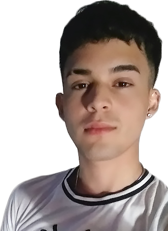
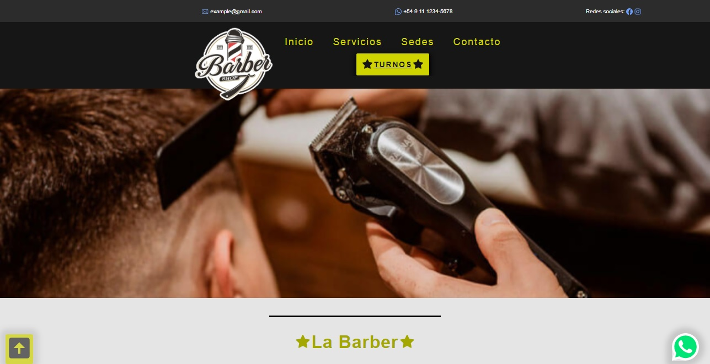
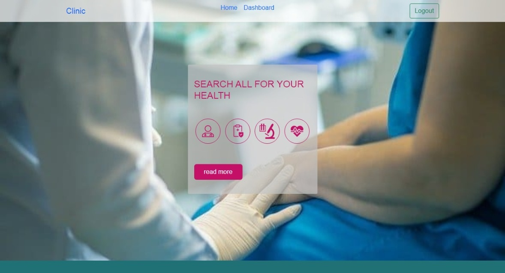
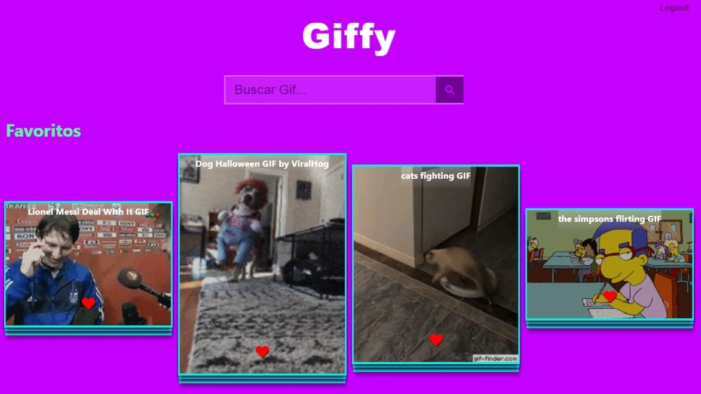

<h2>Hola! Soy Enzo 👋    Desarrollador Web Fullstack 👨‍💻</h2>

✔️  Desde enero de 2021 especializandome en desarrollo web.  
✔️ Desde enero de 2020 programando.  
✔️ Y desde mi primera pc con una computadora.

  
  <h2 align="center">Algunos Trabajos </h2>
  
   
  

<h2 align="center">Contacto </h2>

<a href="https://www.linkedin.com/in/enzo-ramirez-web-developer/">  
<a href="mailto:enzo.g.rz.18@gmail.com"> 

<!--
**EnzoGRDev/enzogrdev** is a ✨ _special_ ✨ repository because its `README.md` (this file) appears on your GitHub profile.

Here are some ideas to get you started:

- 🔭 I’m currently working on ...
- 🌱 I’m currently learning ...
- 👯 I’m looking to collaborate on ...
- 🤔 I’m looking for help with ...
- 💬 Ask me about ...
- 📫 How to reach me: ...
- 😄 Pronouns: ...
- ⚡ Fun fact: ...
-->
